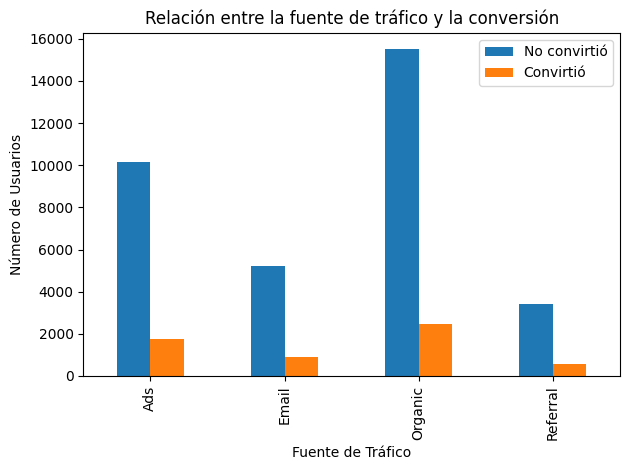
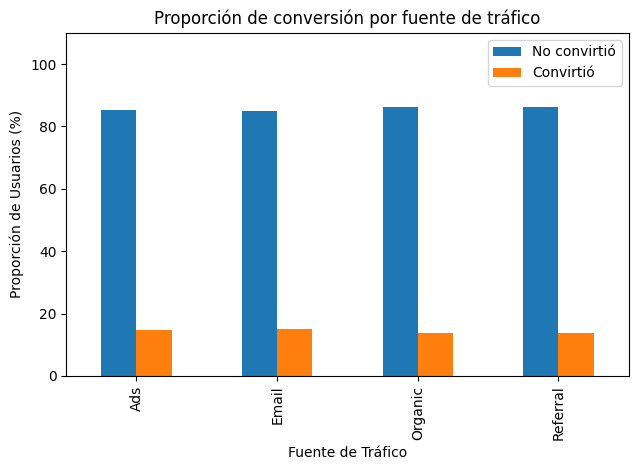
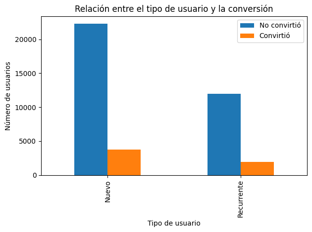
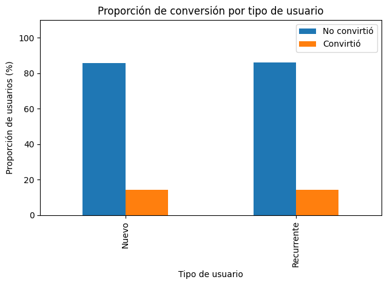

# 📊 Landing Page A/B Testing — Análisis de Conversión e Ingresos

Análisis de prueba A/B aplicado a un experimento de landing page comparando dos variantes (página A y página B) en 40,000 usuarios. El proyecto evalúa si la nueva página genera conversiones e ingresos significativamente mayores que el control, aplicando pruebas estadísticas apropiadas para respaldar la decisión de negocio.

**Herramientas:** Python · Pandas · NumPy · SciPy · statsmodels · Matplotlib

## 🔍 Hallazgos Principales

**Gasto promedio por usuario**
- La página B genera un gasto promedio de $68.75 vs $61.09 de la página A, diferencia estadísticamente significativa (Mann-Whitney U, p = 1.04e-21).

**Tasa de conversión**
- La página B presenta una tasa de conversión de 15.96% vs 12.57% de la página A, diferencia estadísticamente significativa (Z-test, p = 3.76e-22).

**Fuente de tráfico y conversión**
- Existe una asociación estadísticamente significativa entre la fuente de tráfico y la conversión (Chi-cuadrado, p = 0.034). Email presenta la tasa de conversión más alta (14.99%) y Organic el mayor volumen absoluto de conversiones.

**Tipo de usuario y conversión**
- No existe asociación estadísticamente significativa entre el tipo de usuario y la conversión (Chi-cuadrado, p = 0.47). Usuarios nuevos y recurrentes convierten de forma casi idéntica (14.36% vs 14.09%).

## 📈 Visualizaciones

| Volumen por fuente de tráfico | Proporción por fuente de tráfico |
|---|---|
|  |  |

| Volumen por tipo de usuario | Proporción por tipo de usuario |
|---|---|
|  |  |

## 💡 Recomendaciones

- Implementar la página B como versión definitiva, ya que supera a la página A en tasa de conversión y gasto promedio.
- Potenciar el canal Email por su alta tasa de conversión e invertir en segmentación y automatización.
- Reevaluar el canal Referral, que presenta el menor volumen y baja tasa de conversión.
- No diseñar estrategias diferenciadas por tipo de usuario, ya que nuevos y recurrentes convierten de forma idéntica.

## 📂 Dataset

| Archivo | Descripción |
|---|---|
| `landing_experiment.csv` | 40,000 registros de sesiones del experimento A/B |

## 🔍 Etapas del Análisis

1. **Validación de datos** — estructura, tipos de datos, distribución de grupos y calidad
2. **Comparación de gasto promedio** — Mann-Whitney U para comparar gasto entre páginas
3. **Análisis de tasa de conversión** — Z-test de proporciones para comparar tasas de conversión
4. **Fuente de tráfico y conversión** — Chi-cuadrado para evaluar asociación con fuente de tráfico
5. **Tipo de usuario y conversión** — Chi-cuadrado para evaluar asociación con tipo de usuario
6. **Visualizaciones categóricas** — gráficos de volumen y proporción por segmento
7. **Resumen ejecutivo** — conclusiones y recomendaciones para stakeholders

## ▶️ Cómo ejecutar

**Google Colab**

[](https://colab.research.google.com/github/DebbieJara/landing-page-ab-testing/blob/main/AB_Testing_Landing_Page.ipynb)

Haz clic en el badge de arriba y ejecuta las celdas en orden — el dataset ya está en el repositorio.

**Jupyter local**
```bash
git clone https://github.com/DebbieJara/landing-page-ab-testing.git
pip install pandas numpy matplotlib seaborn scipy statsmodels
jupyter notebook
```

Se recomienda ejecutar todas las celdas en orden desde el inicio.

## 👩‍💻 Autora

Debbie Jara · [GitHub](https://github.com/DebbieJara) · Data Analista en formación
